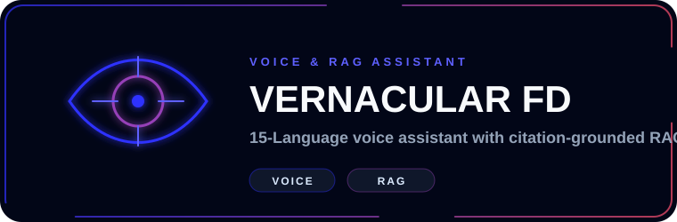
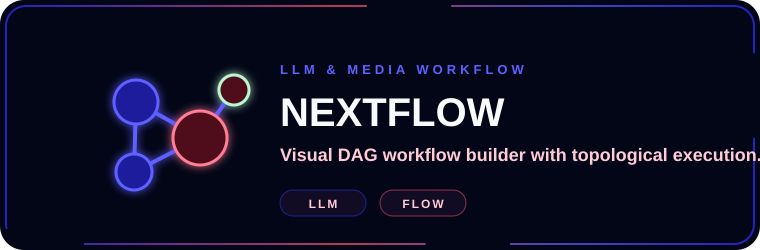
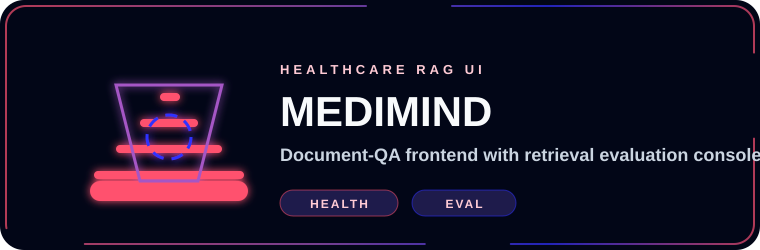
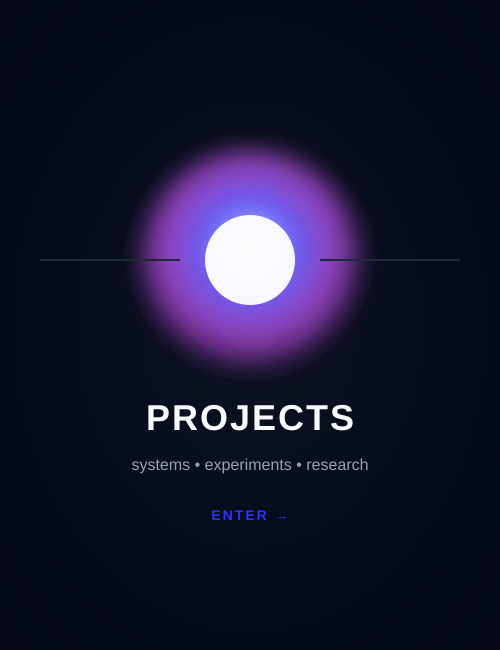
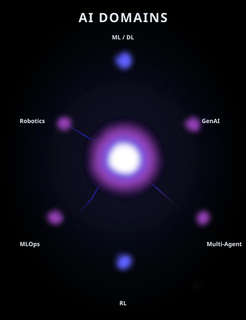
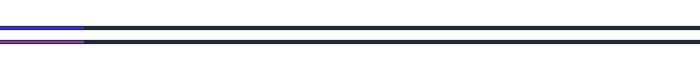
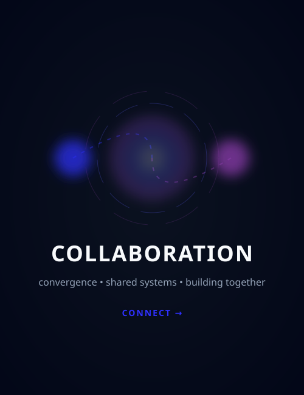

  

<!-- Title -->
<h3 align="center">
    <samp>
        &gt; Hey There!, I am
        <b><a target="_blank" href="https://www.linkedin.com/in/himanshu-sharma-ab7101313/">Himanshu Sharma</a></b>
    </samp>
</h3>

 

<samp>
「 Final-year B.Tech CS Student building Frontend Interfaces &amp; AI-driven Workflows 」  
</samp>

  

<!-- Title -->

  

  

# 🛠 Technologies, Projects, and Domains

<table border="0" cellspacing="10" cellpadding="0">
<tr>

<!-- LEFT: TOOLS -->
<td width="420" valign="top" align="center">

<h3>🛠 Technologies</h3>
 

<table align="center" cellspacing="0" cellpadding="6">
  <tr>
    <td align="center"></td>
    <td align="center"></td>
    <td align="center"></td>
    <td align="center"></td>
    <td align="center"></td>
  </tr>
  <tr>
    <td align="center"></td>
    <td align="center"></td>
    <td align="center"></td>
    <td align="center"></td>
    <td align="center"></td>
  </tr>
  <tr>
    <td align="center"></td>
    <td align="center"></td>
    <td align="center"></td>
    <td align="center"></td>
    <td align="center"></td>
  </tr>
  <tr>
    <td align="center"></td>
    <td align="center"></td>
    <td align="center"></td>
    <td align="center"></td>
    <td align="center"></td>
  </tr>
  <tr>
    <td align="center"></td>
    <td align="center"></td>
    <td align="center"></td>
    <td align="center"></td>
    <td align="center"></td>
  </tr>
</table>

</td>

<!-- PROJECTS -->
<td width="260" valign="top" align="center">

<h3>🧪 Projects</h3>
 

  

</td>

<!-- AI DOMAINS -->
<td width="260" valign="top" align="center">

<h3>🧠 AI Domains</h3>
 

    

</td>

</tr>
</table>

### 📊 Vital Statistics

  

  

    

  

<table width="100%" border="0" cellspacing="10" cellpadding="0">
<tr>

<!-- LEFT: COLLAB -->
<td width="33%" valign="top">

<h2>🤝 Collaboration</h2>

I’m open to collaborating on:

<ul>
  <li>Machine learning and computer vision applications</li>
  <li>Full-stack web applications &amp; API services</li>
  <li>Data structures, algorithms, and logical solvers</li>
  <li>Security-oriented steganography tools</li>
</ul>

</td>

<!-- MIDDLE: PANEL -->
<td width="34%" align="center" valign="middle">
    
</td>

<!-- RIGHT: CONTACT -->
<td width="33%" valign="top" align="center">

<h2>📫 Contact</h2>

 

  

  

  

</td>

</tr>
</table>

⚡ Building intelligent systems and scalable software engineering solutions

Star ⭐ the repos if they helped you!

  <a href="./CODE_OF_CONDUCT.md">Code of Conduct</a> ·
  <a href="./CONTRIBUTING.md">Collaboration</a> ·
  <a href="./SECURITY.md">Security</a>

 

  

