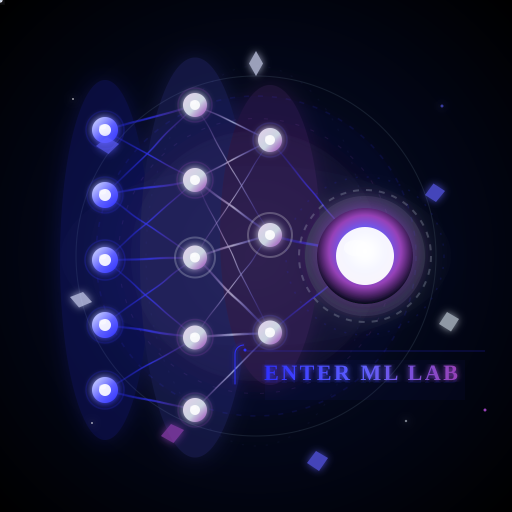

  

  
  
  

  
  

---

  <b>The AI areas I care about most are the ones where models, optimization, and real-world systems meet.</b>

  This page maps the technical domains behind my projects and labs: machine learning models, secure data encoding, full-stack inventory analytics, and interactive financial advisors.

    

## Core Domains

  

## Labs

| Lab | Purpose |
| --- | --- |
| [Glaucoma ML Lab](https://github.com/HIMpcgithub3000/Glaucoma_Dectection_Machine_learning) | Identify glaucoma from eye scans using deep learning. |
| [Steganography Lab](https://github.com/HIMpcgithub3000/steganography_him) | Hide messages invisibly in image and audio files. |
| [Stock Analyst Lab](https://github.com/HIMpcgithub3000/Quantitative_analysis_of_stocks) | Apply quantitative models to analyze stock trends. |

## Engineering Principles

  

