<p align="center">
  
</p>

<p align="center">
  <a href="../README.md">
    
  </a>
  <a href="./PROJECTS.md">
    
  </a>
  <a href="./AI_DOMAIN.md">
    
  </a>
</p>

<p align="center">
  <a href="https://github.com/HIMpcgithub3000">
    
  </a>
  <a href="./COLLAB.md">
    
  </a>
</p>

---

<p align="center">
  <b>Collaboration is most interesting to me when the work has a real system behind it: clear constraints, hard technical questions, and enough ambition to be worth engineering properly.</b>
</p>

<p align="center">
  I am especially interested in machine learning models, data security/steganography, full-stack application development, financial data modeling, and developer tooling.
</p>

<p align="center">
  
</p>

---

## Collaboration Protocol

I like collaborations where the idea can survive contact with implementation. That usually means the project has a concrete problem, a visible technical path, and enough discipline to turn exploration into something usable.

| Signal | What it means |
| --- | --- |
| `BUILD` | There is a real artifact to design, implement, test, or improve. |
| `RESEARCH` | There is a question worth investigating, not just a vague topic. |
| `SYSTEMS` | The work involves architecture, reliability, scale, reproducibility, or tooling. |
| `LEARNING` | The output helps people understand a difficult technical concept more clearly. |
| `OPEN SOURCE` | The project benefits from public documentation, clean interfaces, and maintainable structure. |

## High-Value Collaboration Zones

### Machine Learning & Vision
Computer vision models, image processing pipelines, deep learning classifiers, model metrics, and data pre-processing automation. I care about making ML algorithms work in real-world scenarios.

### Steganography & Data Security
Secure data encoding, steganographic algorithms for files (image, audio), encryption layers, and web interfaces for secure data transfer.

### Full-Stack Engineering
Fast, clean API services, database optimization, responsive frontend pages, and end-to-end user dashboards.

### Financial Stock Analytics
Quantitative analytics, stock market datasets, mathematical modeling, and predictive visualizations in Python.

### Interactive Technical Labs
Tools like Glaucoma ML Lab, Steganography Lab, and Stock Analyst Lab: visual environments that make complex ideas easier to explore directly.

### Technical Communication & Developer Experience
README systems, clean diagrams, documentation structure, and visual interfaces. Good engineering is easier to trust when it is easier to inspect.

## What Makes A Strong First Message

The best collaboration message is short, specific, and grounded.

```text
Subject: Collaboration idea: <short project name>

I am building / exploring:
<one or two sentences>

The technical problem is:
<what is hard, unclear, or worth solving>

What exists now:
<repo, demo, paper, sketch, notes, or current status>

Where I think you might fit:
<architecture, ML models, steganography, full-stack, documentation, etc.>

First useful milestone:
<something small enough to actually start>
```

If the first milestone is clear, the conversation can become technical quickly. That is usually a good sign.

## Good Fit / Poor Fit

<p align="center">
  
</p>

## Operating Style

<p align="center">
  
</p>

## Contact Vector

If the work connects to machine learning, full-stack applications, steganography, or financial modeling, send the idea through one of the channels listed in the main [README](../README.md#-contact).

Useful links:

- [Projects](./PROJECTS.md)
- [AI Domains](./AI_DOMAIN.md)
- [GitHub Profile](../README.md)

---

# 🐍 Contribution Journey
<p align="center">
  
</p>
