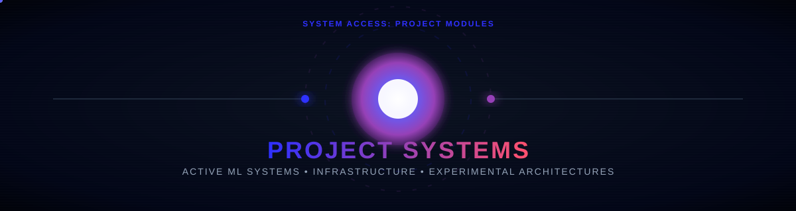
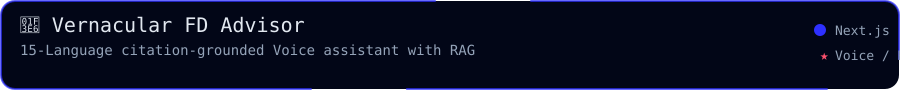
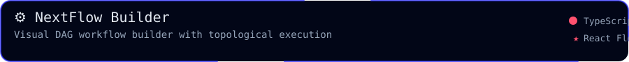
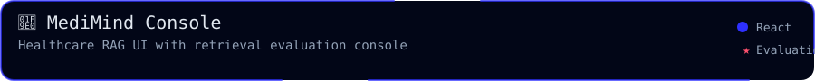

  

  
  
  

  
  

---

  <b>Selected work across AI workflow builders, multilingual speech assistants, healthcare RAG, and frontend architectures.</b>

  This page highlights projects that match the main direction of my GitHub profile: building practical applications around LLM workflow orchestration, secure data retrieval, voice interfaces, and developer-facing console dashboards.

<h2 align="center">🧪 Project Highlights</h2>

<!-- Row 1 -->

  
  

<!-- Row 2 -->

  

## Project Index

| Project | Focus | Status | Why it matters |
| --- | --- | --- | --- |
| [Vernacular FD Advisor](https://github.com/HIMpcgithub3000/Vernacular-FD-Advisor) | Multilingual voice UX, Speech STT/TTS, RAG retrieval | Maintained | Citation-grounded assistant supporting 15 Indian languages with Web Speech API and Python/FAISS RAG backend. |
| [NextFlow](https://github.com/HIMpcgithub3000/nextflow) | LLM workflow orchestration, visual DAG builder, Trigger.dev | Active | Visual DAG builder using React Flow and Node.js topological executor to run Gemini vision and media workers. |
| [MediMind](https://github.com/HIMpcgithub3000/medimind) | Healthcare QA UI, retrieval evaluation console | Active | Document-QA frontend with SSE streaming chat, confidence badges, and parameter configuration console. |
| [Blostem LLM Dashboard](https://github.com/HIMpcgithub3000) | OpenRouter integration, monitoring APIs | Completed | Python/FastAPI internal dashboard to monitor LLM token usage, rate limits, and audits for 50+ employees. |
| [UptoSkills HRMS Flow](https://github.com/HIMpcgithub3000) | Reusable React components, state-driven flows | Completed | Developed 12 reusable React elements, increasing HRMS engagement metrics by 40%. |
| [PitchX Features](https://github.com/HIMpcgithub3000) | Full Stack, BMU Incubator, API endpoints | Completed | Implemented 8 features across 3 modules in 14 weeks, lowering ticket turnaround times from 5 days to 2. |

## Current Direction

  

## What To Look At First

  

---

<h2 align="center">📊 Activity</h2>

  

  

