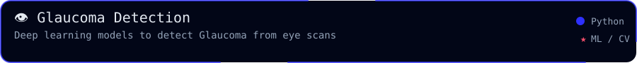
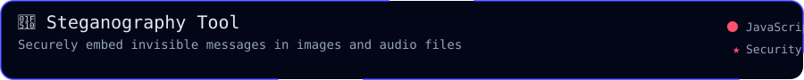
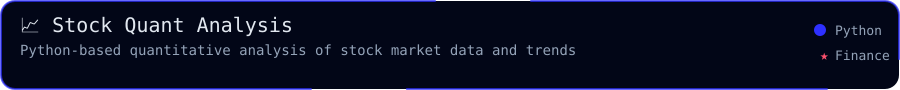
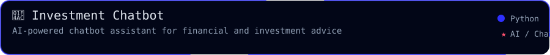
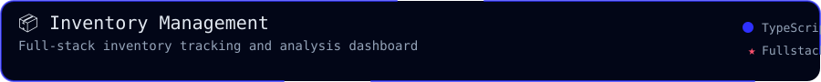

  

  
  
  

  
  

---

  <b>Selected work across AI systems, machine learning models, security steganography, and financial analytics.</b>

  This page highlights projects that match the main direction of my GitHub profile: building practical applications around ML models, secure data encoding, full-stack inventory management, and financial advisors.

<h2 align="center">🧪 Project Highlights</h2>

<!-- Row 1 -->

  
  

<!-- Row 2 -->

  
  

<!-- Row 3 -->

  
  

## Project Index

| Project | Focus | Status | Why it matters |
| --- | --- | --- | --- |
| [Glaucoma Detection](https://github.com/HIMpcgithub3000/Glaucoma_Dectection_Machine_learning) | Deep learning, Computer Vision, Medical ML | Maintained | Leverages transfer learning models to diagnose glaucoma from ocular fundus scans, promoting early detection. |
| [Steganography Tool](https://github.com/HIMpcgithub3000/steganography_him) | Data security, Cryptography, Web app | Active | Encodes text payloads invisibly inside audio and image files without visual or auditory degradation. |
| [Quantitative Stock Analysis](https://github.com/HIMpcgithub3000/Quantitative_analysis_of_stocks) | Finance, Data analytics, Python modeling | Completed | Employs mathematical and quantitative finance models to identify stock trends and optimal investment strategies. |
| [Investment Chatbot](https://github.com/HIMpcgithub3000/investment_chatbot) | Natural Language Processing, Conversational AI | Active | Interactive assistant that helps users understand finance questions and find stock patterns. |
| [Inventory Management System](https://github.com/HIMpcgithub3000/Inventory_Management_System) | Database design, Full-stack dashboard | Completed | Provides full-scale stock tracking, sales reporting, and logistics organization for businesses. |
| [Vernacular FD Advisor](https://github.com/HIMpcgithub3000/Vernacular-FD-Advisor) | Localization, Web utility | Maintained | Assists non-English-speaking users in evaluating fixed deposit schemes and banking returns. |

## Current Direction

  

## What To Look At First

  

---

<h2 align="center">📊 Activity</h2>

  

  

